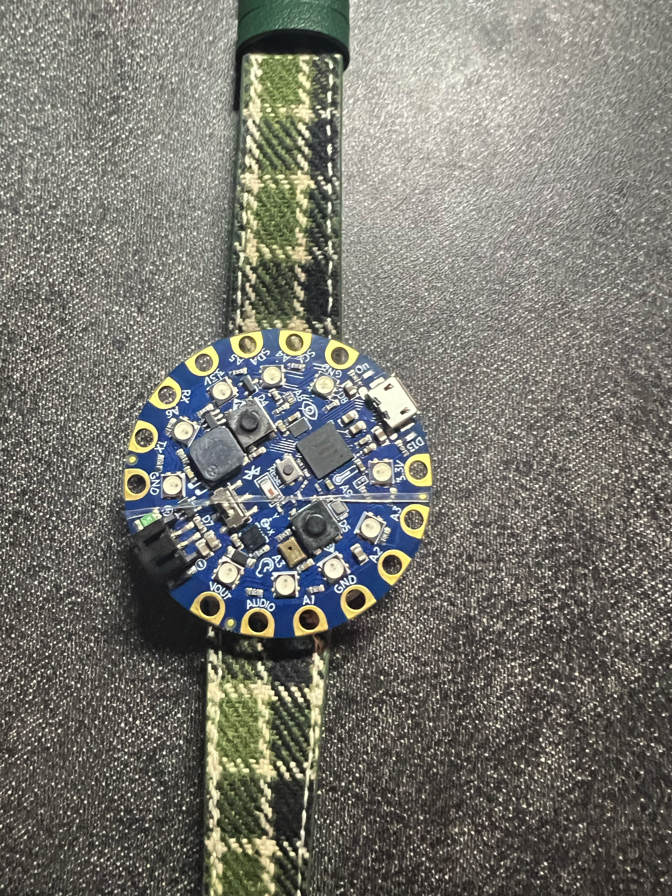
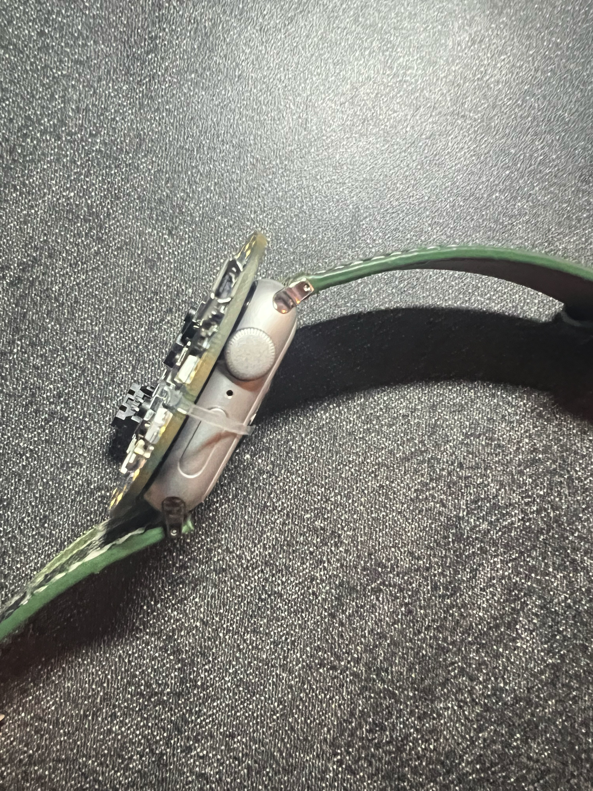

### Project Description
This project transforms an Adafruit Circuit Playground into a wearable workout assistant that uses its built-in accelerometer to detect when you perform a specific movement, such as lifting a dumbbell or kettlebell. The device provides auditory feedback through sounds to indicate the start and end of a workout set and to count repetitions.

### Key Features
- **Motion Detection**: Utilizes the accelerometer to detect workout repetitions when a set threshold is exceeded.
- **Auditory Feedback**: Plays tones to indicate the start of a rep, the completion of a rep, and the completion of a set.
- **LED Indications**: Uses the onboard red LED to show the start and end of workout sets.

### Adjustable Parameters
- `sets`: Number of sets to complete during a workout session.
- `reps_per_set`: Number of repetitions in each set.
- `threshold`: Acceleration threshold to detect movement, which can be adjusted based on the intensity or type of exercise.

### Usage
This tool is designed to be versatile for various strength training exercises, including dumbbell and kettlebell workouts. It helps in maintaining consistent exercise performance by tracking reps and sets through sensor data.
### Code
View the script by navigating to [code.py](./code.py) in the project directory.

### Visuals
For an overview of how the wearable device looks, refer to the images:
- 
- 
- **Video Demonstration**: [[Link to the demo video](https://drive.google.com/file/d/1ncrKjRcByigJREtMyB1X0YjKiuNG2gcC/view?usp=sharing)]

